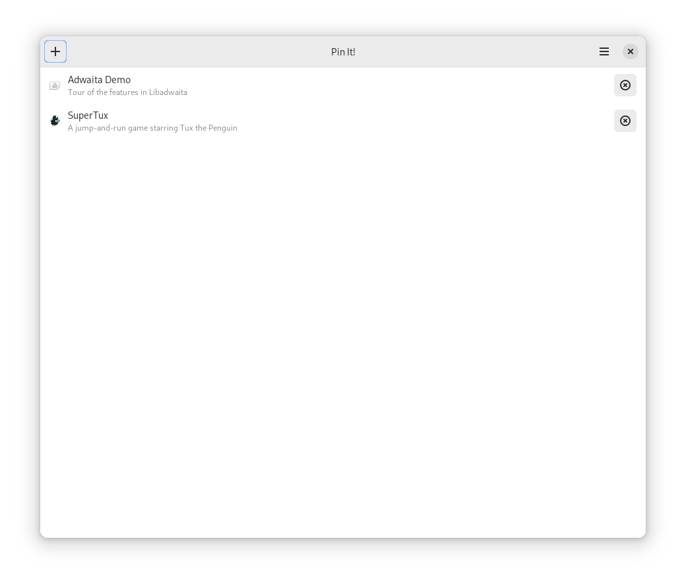
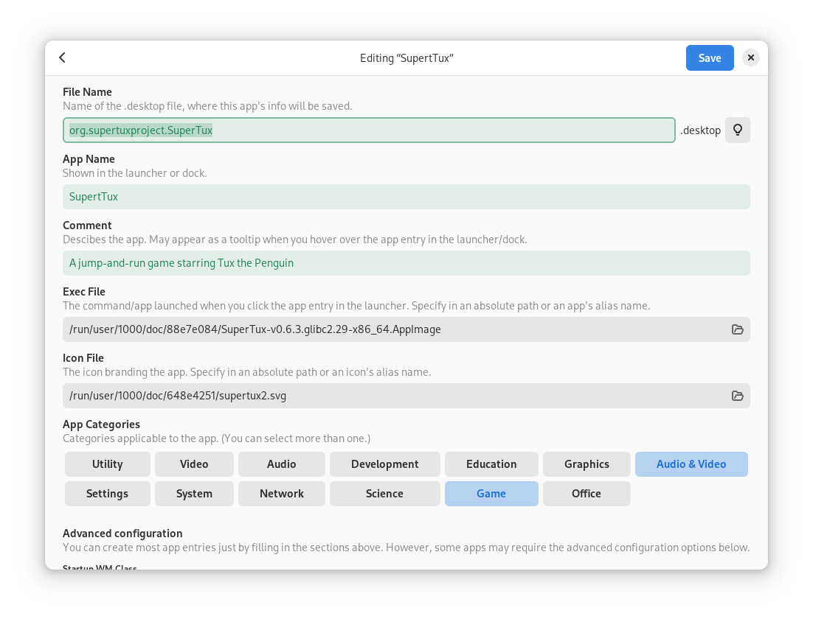

# Pin It!
Pin shortcuts for portable apps like raw executable files, AppImage files, etc. to the app launcher on your desktop.





Other features include:

- Edit or delete created app entries without opening the file manager
- Automatically add execution permission to the file you select
- Syntax error detection
- Automatically save everything―your data in editing, last open view, and preferences

The original idea of the app is inspired from https://github.com/alexkdeveloper/dfc.

## Installation
### For Users
You can download the app from Flathub, which should make this app available for all Linux distribution:

[](https://flathub.org/apps/details/com.github.ryonakano.pinit)

We originally targeted this app for elementary OS and also released it on Flathub after some time, but **we decided to publish the app only on Flathub since version `2.0.0`. We no longer publish new features or bug fixes to the elementary-curated version of the app.**

This does not mean the app no longer available on elementary OS. You can simply switch to the Flathub version of the app; please uninstall the current installation and then re-install the app from Flathub.

### For Developers
You'll need the following dependencies to build:

* libadwaita-1-dev (>= 1.4.0)
* libgee-0.8-dev
* libglib2.0-dev (>= 2.74)
* libgtk-4-dev (>= 4.10)
* meson (>= 0.57.0)
* valac

Run `meson setup` to configure the build environment and run `ninja` to build

```bash
meson setup builddir --prefix=/usr
ninja -C builddir
```

To install, use `ninja install`, then execute with `com.github.ryonakano.pinit`

```bash
ninja install -C builddir
com.github.ryonakano.pinit
```

## Contributing

Please refer to [the contribution guideline](CONTRIBUTING.md) if you would like to:

- submit bug reports / feature requests
- propose coding changes
- translate the project

## Get Support

Need help in use of the app? Refer to [the discussions page](https://github.com/ryonakano/pinit/discussions) to search for existing discussions or [start a new discussion](https://github.com/ryonakano/pinit/discussions/new/choose) if none is relevant.
