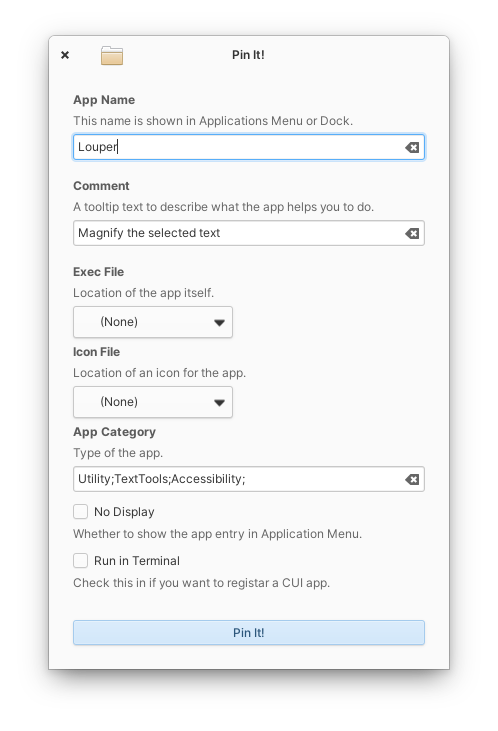

# Pin It!

Pin any apps into the launcher. Inspired from https://github.com/alexkdeveloper/dfc

## Installation

### For Developers

You'll need the following dependencies to build:

* libgtk-3.0-dev
* libgranite-dev (>= 6.0.0)
* meson (>=0.49.0)
* valac

Run `meson build` to configure the build environment. Change to the build directory and run `ninja` to build

    meson build --prefix=/usr
    cd build
    ninja

To install, use `ninja install`, then execute with `com.github.ryonakano.pin-it`

    ninja install
    com.github.ryonakano.pin-it
