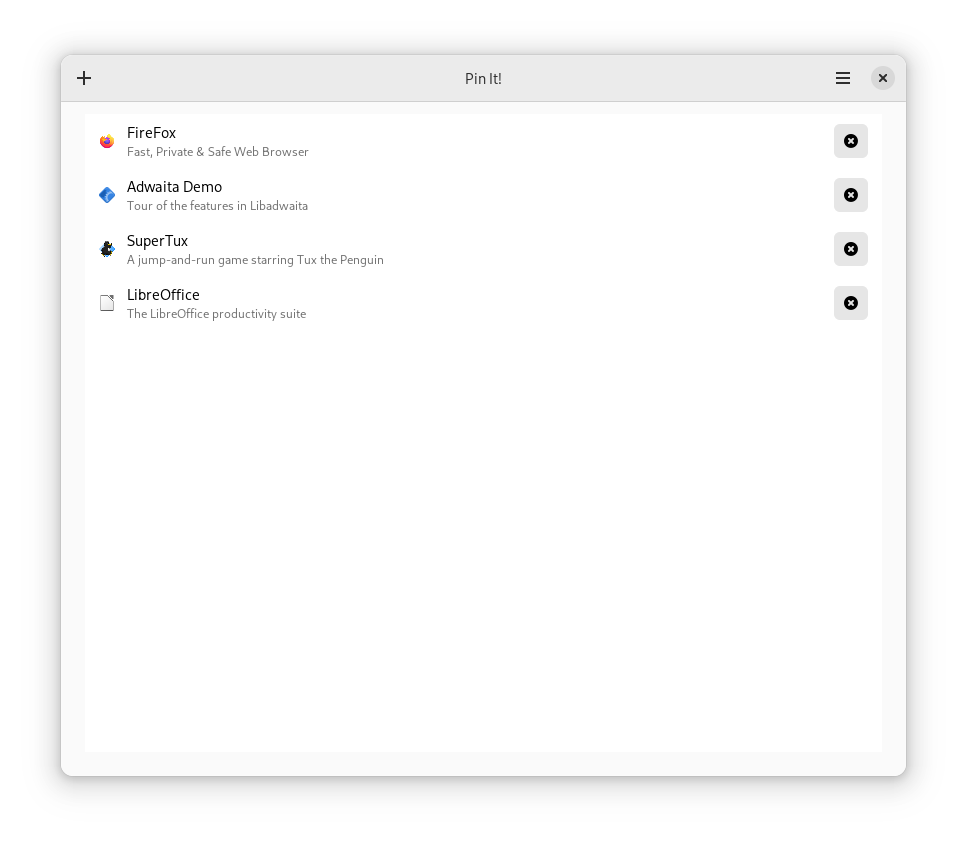
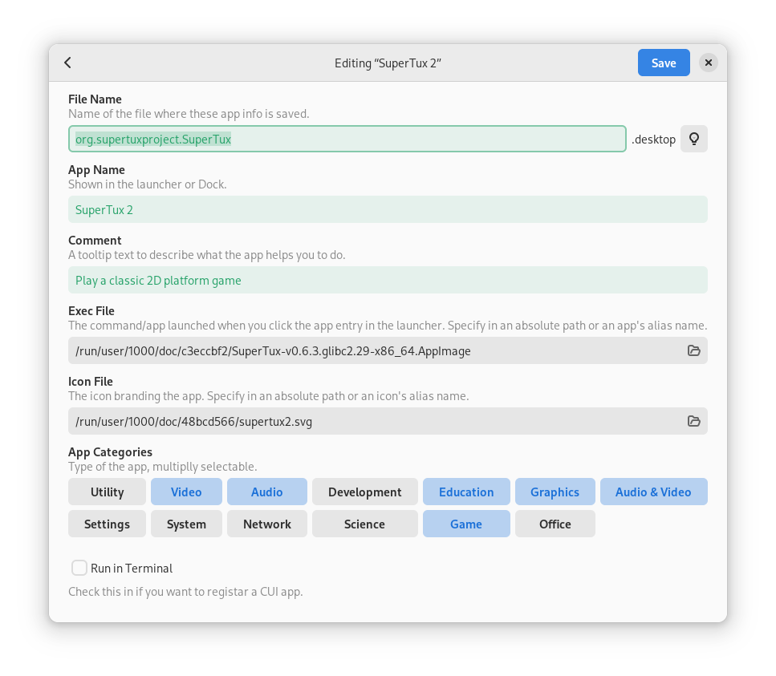

# Pin It!
Create the shortcut to portable apps like raw executable files, AppImage files, etc. into the app launcher of your desktop environment.

Other features include:

- Edit or delete created app entries without opening the file manager
- Automatically add execution permission to the file you select
- Syntax error detection
- Automatically save everything―your data in editing, last open view, and preferences

The original idea of the app is inspired from https://github.com/alexkdeveloper/dfc.

## Installation
### For Users
You can download the app from Flathub, which should make this app available for all Linux distribution:

We originally target this app for elementary OS and also released it on Flathub after some time, but **we decided to publish the app only on Flathub since version `2.0.0`. We no longer publish new features or bug fixes to the elementary-curated version of the app.** This does not mean the app no longer available on elementary OS. You can simply switch to the Flathub version of the app; please uninstall the current installation and then re-install the app from Flathub.

### For Developers
You'll need the following dependencies to build:

* libgee-0.8-dev
* libgtk4-dev
* libadwaita-1-dev
* meson (>= 0.57.0)
* valac

Run `meson build` to configure the build environment. Change to the build directory and run `ninja` to build

    meson build --prefix=/usr
    cd build
    ninja

To install, use `ninja install`, then execute with `com.github.ryonakano.pinit`

    ninja install
    com.github.ryonakano.pinit

## Help Translation of This Project!
We accept translations of this project through [Weblate](https://weblate.org/). We would appreciate it if you would join our translation work!

Click the following graphs to get started:

| Main: Texts in the app itself | Extra: Texts in the desktop entry and the software center |
| --- | --- |
|  |  |
