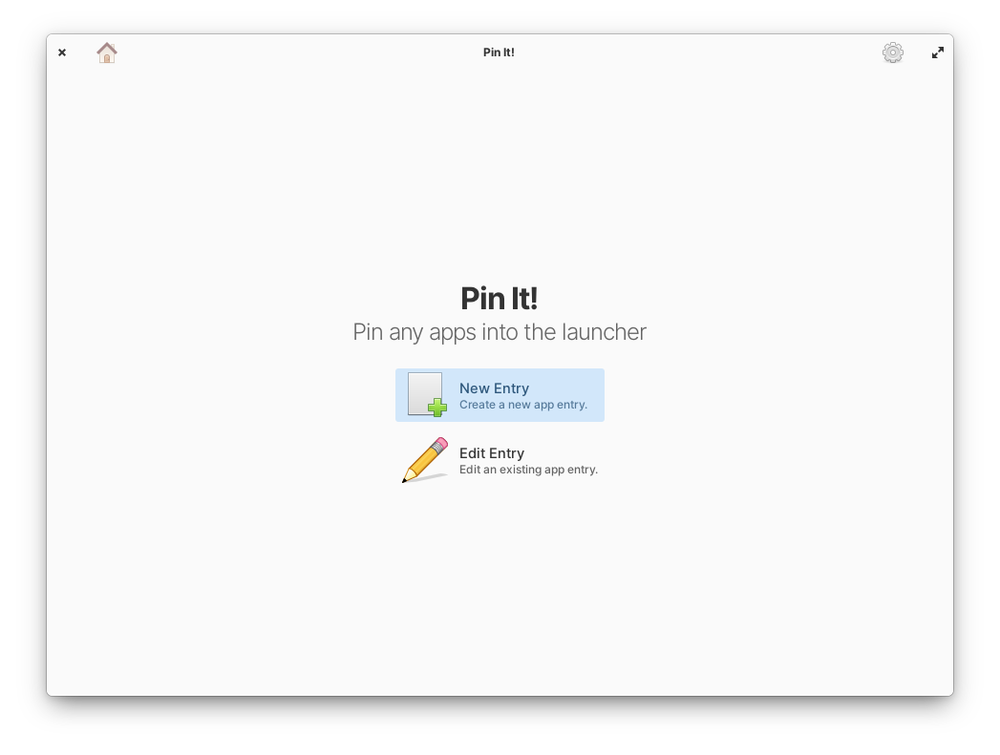
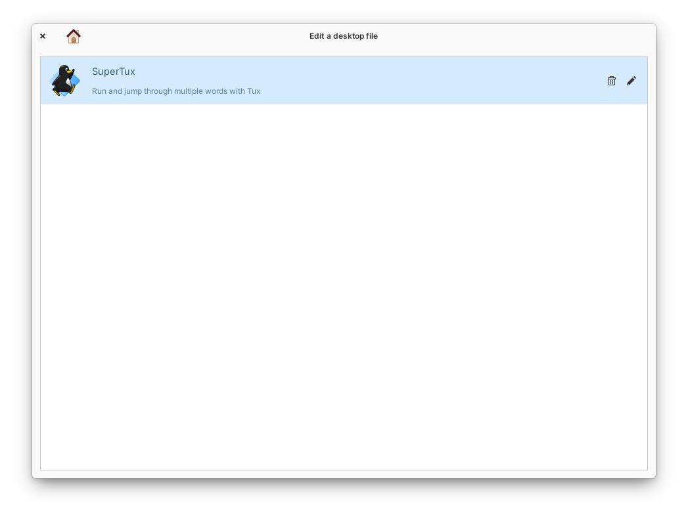
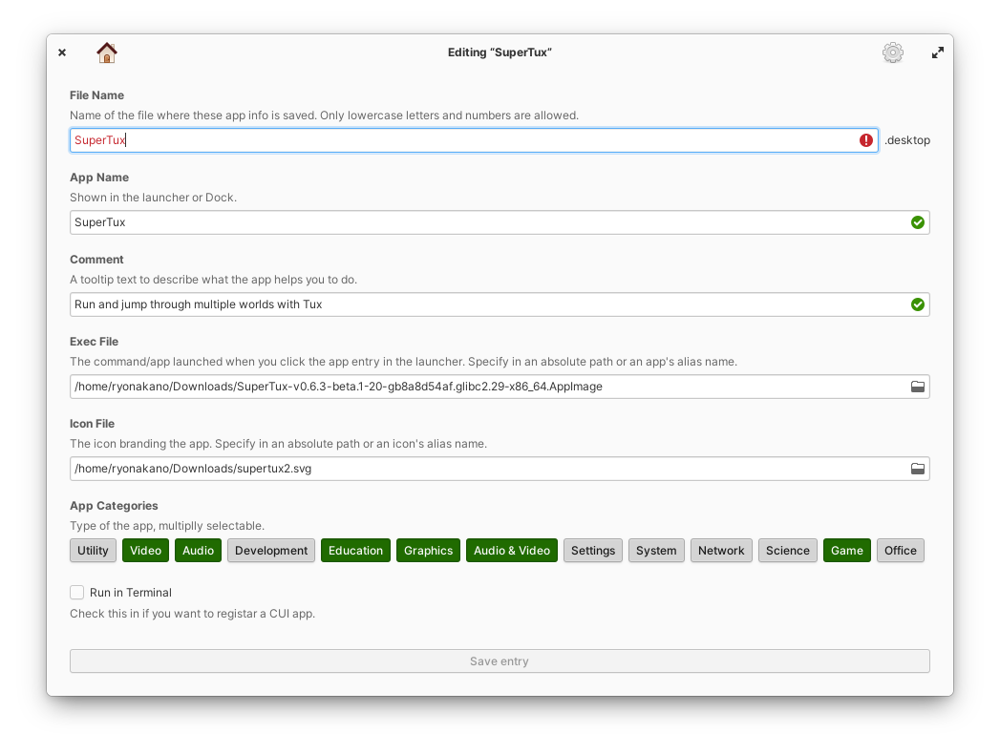

# Pin It!
Pin any apps into the launcher. Inspired from https://github.com/alexkdeveloper/dfc

Add portable apps like raw executable files, AppImage files, etc. into the launcher easily. Edit or delete existing desktop files without opening a file manager.

Are you still using your text editor to create/edit your customized desktop files? Possibly you open Files and press Ctrl + H to show the hidden destination folder? Say goodbye to that life! Hit the "Edit File" in this app and it's done. All entries you created are there and you can edit or delete them.

You surely created a desktop entry but it won't be shown in the launcher? Ah, you found a tiny syntax error after a couple of hours in struggle! That's too bad. Pin It! prevent saving destkop entries with any syntax error, so you will never need to waste your time.

## Installation
### For Users
On elementary OS? Click the button to get Pin It! on AppCenter:

You can also download the app from Flathub, in case you're using another distribution. This version is tweaked to work well and look good on other desktop environment.

### For Developers
You'll need the following dependencies to build:

* libgtk-3.0-dev
* libgranite-dev (>= 6.0.0)
* libhandy-1-dev
* meson (>=0.49.0)
* valac

Run `meson build` to configure the build environment. Change to the build directory and run `ninja` to build

    meson build --prefix=/usr
    cd build
    ninja

To install, use `ninja install`, then execute with `com.github.ryonakano.pinit`

    ninja install
    com.github.ryonakano.pinit

## Contributing
There are many ways you can contribute, even if you don't know how to code.

### Reporting Bugs or Suggesting Improvements
Simply [create a new issue](https://github.com/ryonakano/pinit/issues/new) describing your problem and how to reproduce or your suggestion. If you are not used to do, [this section](https://docs.elementary.io/contributor-guide/feedback/reporting-issues) is for you.

### Writing Some Code
We follow [the coding style of elementary OS](https://docs.elementary.io/develop/writing-apps/code-style) and [its Human Interface Guidelines](https://docs.elementary.io/hig/). Try to respect them.

### Translating This App
I accept translations through Pull Requests. If you're not sure how to do, [the guideline I made](po/README.md) might be helpful.
