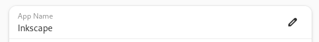
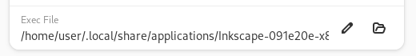
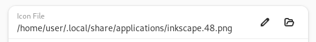
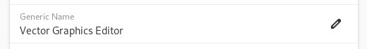
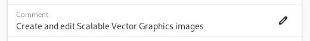
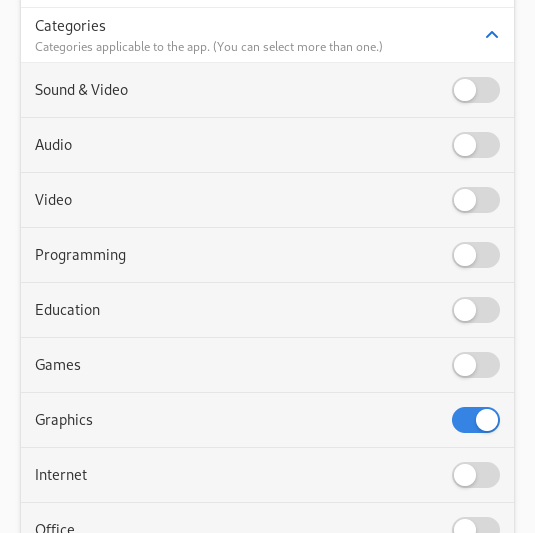
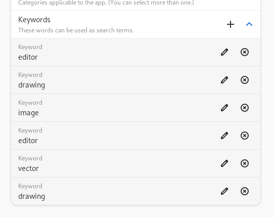
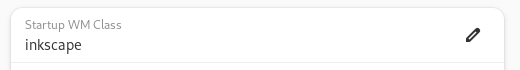
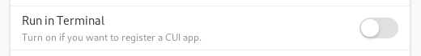

Pin It! allows you to easily create shortcut entry of your favorite portable apps to the app launcher.
It respects [Desktop Entry Specification by freedesktop.org](https://specifications.freedesktop.org/desktop-entry-spec/desktop-entry-spec-latest.html).

Here are the descriptions of what each field in the app does and which key in the specification it corresponds.

## Required Fields
### App Name

The name of your app.

The text you specified would be shown in the launcher or dock.

- Key name in Desktop Entry Specification: `Name`

### Exec File

The command/app launched when you click the app entry in the launcher. Specify in an absolute path or an app's alias name.

You can use the right button to navigate and select your app instead of specifying the path manually.

- Key name in Desktop Entry Specification: `Exec`

## Optional Fields
### Icon File

The icon branding the app. Specify in an absolute path or an icon's alias name.

You can use the right button to navigate and select your favorite icon. ICO, PNG, SVG, and XMP files are supported.

The icon you specified would be shown in the app launcher or dock.

- Key name in Desktop Entry Specification: `Icon`

### Generic Name

Generic name of the app, for example "Web Browser" or "Mail Client". This text is used in some desktop environment like KDE.

<!-- TODO Screenshot -->

- Key name in Desktop Entry Specification: `GenericName`

### Comment

Descibes the app. May appear as a tooltip when you hover over the app entry in the launcher/dock.

- Key name in Desktop Entry Specification: `Comment`

### Categories

Categories applicable to the app. App launchers that groups follows this selection.

- Key name in Desktop Entry Specification: `Categories`

### Keywords

Words that can be used to search your app in the app launcher.

- Key name in Desktop Entry Specification: `Keywords`

## Advanced Configurations
### Startup WM Class

Associate the app with a window that has this ID. Use this if a different or duplicated icon appears in the dock when the app launches. This often happens when your app is a wrapper.

- Key name in Desktop Entry Specification: `StartupWMClass`

### Run in Terminal

Whether the program runs in a terminal window.

- Key name in Desktop Entry Specification: `Treminal`
